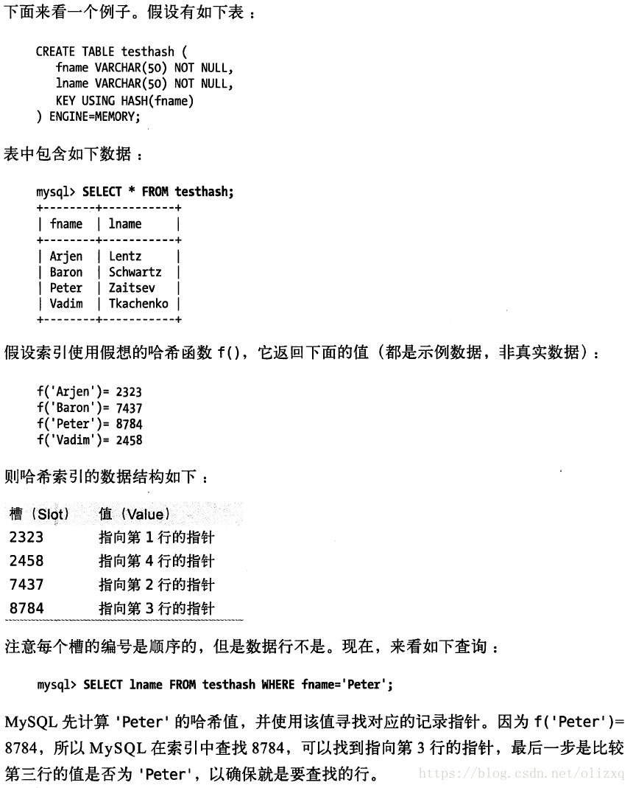

## 一、常见的索引类型

#### 1. 哈希索引

**哈希索引(Hash Index)**基于哈希表实现，**只适合精确匹配，不适合范围查找**。对于每一行数据，存储引擎都会使用一个哈希函数，对改行的对应索引列计算`哈希code`，通过 **K-V** 的形式保存起来，其中“K”为哈希code，“V”是指向改行记录的指针。

使用哈希索引，有一点需要注意：如何解决哈希冲突？就目前而言，大多数使用 **“链接法”**——冲突之后，在原来的位置添加一个链表结构，多个冲突值通过链表的形式保存；当查询的时候，通过哈希code定位到对应的链表，之后遍历链表，直到找到符合条件的。

借用《高性能MySQL》中实例：



**哈希索引的特点**：

- **哈希索引只包含哈希值和行指针，不存储字段值**。因此**无法使用覆盖索引**等相关特性；
- 哈希索引并不按照索引值顺序存储，因此**不适合排序操作**；
- 哈希索引**不支持部分索引列匹配查找**，因为计算哈希时，始终使用的是索引列的全部内容。例如，在数据列<A, B>上建立哈希索引，如果查询的只有<A>，那么无法使用该索引，因为hash(<A, B>) 和 hash(<A>) 的结果一点关系都没有；
- 哈希索引**只支持等值比较**( **=**、**IN()**和 **<=>**(效果等同于等号，不过可以比较NULL))，**不支持任何的范围查询**(比如 **BETWEEN**、**<**等)；
- 访问哈希索引的速度非常快，除非出现很多的哈希冲突，此时的查询会退化成链表的遍历；
- 如果哈希冲突很多的话，索引的维护代价将会非常高，此时对索引的增删改，回退化成对链表的增删改，**O(n)**的时间复杂度。

**创建自定义的哈希索引：**

通过一个实例来说明：

- 提出问题：假如我们要存储大量的**URL**，同时还有通过 **URL** 查询该条记录的需求，应该如何建立索引？
- 调研：如果直接在URL上建立索引，那么索引会很长，并且很大
- 解决方案：删除原来URL上的索引，新增一个被索引的 **url_crc** 列，存储 URL 列被 **CRC32** 之后的值，之后的查询可通过这个索引来查。缺点是还要花时间维护这个索引列。

```mysql
# 建表
CREATE TABLE url_demo (
	id int unsigned NOT NULL auto_increment,
    url varchar(255) NOT NULL,
    url_crc int unsigned NOT NULL DEFAULT 0,
    PRIMARY KEY(id)
);

# 为了减少维护工作，可以创建一个触发器
DELIMITER // 
CREATE TRIGGER url_demo_crc_ins BEFORE INSERT ON url_demo FOR EACH ROW BEGIN
SET NEW.url_crc=crc32(NEW.url);
END;

CREATE TRIGGER url_demo_crc_upd BEFORE UPDATE ON url_demo FOR EACH ROW BEGIN
SET NEW.url_crc=crc32(NEW.url);
END;
//
DELIMITER ;

# 之后可验证增删改查
INSERT INTO url_deml(url) VALUES("https://www.baidu.com");
SELECT * FROM url_demo;
+----+-----------------------+------------+
| id | url                   | url_crc    |
+----+-----------------------+------------+
|  1 | https://www.baidu.com | 3010065587 |
+----+-----------------------+------------+
UPDATE url_demo SET url="https://www.google.com" WHERE id=1;
SELECT * FROM url_demo;
+----+------------------------+-----------+
| id | url                    | url_crc   |
+----+------------------------+-----------+
|  1 | https://www.google.com | 857627499 |
+----+------------------------+-----------+

# 查询某个具体的URL时，必须使用下面的查询方法：
SELECT * FROM url_demo WHERE url_crc=CRC32("https://www.google.com") AND url="https://www.google.com";
```

#### 2. B-Tree 索引

当人们谈论索引时，如果没有特别指明类型，那多半说的是 **B-Tree索引**。它使用 **B树**(部分引擎使用 **B+树**)作为底层的数据结构，这通常意味着被索引的值都是按顺序存储的(首先是个 **二叉排序树**)，并且每一个叶子节点到根节点的举例相同(变形的 **多叉排序树**)。树的深度和表的大小直接相关。

假如我们有如下数据表：

```mysql
CREATE TABLE people (
	last_name varchar(64) NOT NULL,
    first_name varchar(64) NOT NULL,
    dob date NOT NULL,
    gender enum('m','f') NOT NULL,
    key(last_name, first_name, dob)
);
```

下图显示了该索引时如何组织数据的：


以下情况，索引(`key(last_name, first_name, bob)`)是有效的：

- **全值匹配**：指查询的列和索引中的列完全匹配(字段以及对应的字段顺序)，例如 `SELECT * FROM people WHERE last_name= ‘Allen’ AND first_name = 'Cuba' AND bob = '1960-01-01'`；
- **最左前缀匹配**：索引的顺序非常重要：
  - 可以匹配所有`last_name = ‘Allen’`的人，因为 `last_name`  是索引列中最左边的；
  - 可以只匹配某一列的值得开头部分，如 `last_name` 全部以 `K` 开头，即 `last_name like 'K%’`，注意，这里也是针对最左边的列；
  - 可以匹配 `last_name` 在 `Allen` 和 `Barrymore` 之间的人，即 `last_name > ‘Allen’ AND last_name < 'Barrymore’ `，这里也是针对最左边列；
  - 精准访问某一列并范围匹配另一列：例如第一列`last_name`全匹配，第二列`first_nbame` 范围匹配；或者`last_name`和`first_name`全匹配，第三列`bob`范围匹配。
- **只访问索引的查询**：即 **覆盖索引**。即`select`的字段就属于索引列，而不用通过“回表”再拿一次。关于覆盖索引，后面会详细介绍。

以下情况，索引会失效（即不会使用之前创建的索引 `key(last_name, first_name, bob)`）：

- **单独列非最左列，索引失效**，即 如果不是按照索引的最左列开始查找，无法使用索引。例如：无法查找 `WHERE first_name = ‘Bill’`；例如 `WHERE bob = '1960-01-01’`；例如 `WHERE first_name like 'K%'`。因为查询的列都不是该索引的最左列。同理，`WHERE last_name like '%L’`也会失效。 
- **跳过某一列，索引失效**。即 `WHERE last_name='Allen' AND bob='1960-01-01’`也不会使用该索引，因为跳过了列`first_name`。
- **某列范围查询，右边所有列无法使用索引优化查询**。如 `WHERE last_name='Allen' AND first_name like ‘J%’ AND bob='1960-01-01'`，那么`bob`列无法使用索引优化查询，因为中间的`first_name LIKE`是一个范围条件。

**如果使用`B-Tree`，创建多列索引时，列的顺序非常重要！**

## 二、高性能的索引策略

正确地创建和使用索引是实现高性能查询的基础。下面介绍如何正确地运用索引。

### 1. 查询时，索引列单独放在比较符号的一侧

如果查询中的列不是独立的，则MySQL不会使用索引。 **独立的列** 是指索引列**不能是表达式的一部分**，也**不能是函数的参数**。

下面这个查询就无法使用`score`列的索引：

```mysql
SELECT * FROM student WHRER score + 1 = 90;
```

我们都知道上述查询中表达式的值是89，但是**MySQL无法解析这个方程式**。**我们应该养成简化MySQL`WHERE`条件的习惯，始终将索引列单独放在比较符号的一侧。**

### 2. 前缀索引和索引选择性

**索引选择性**是指 不重复的索引数(I) 和 数据表的记录总数(S) 的比值，即 $I/S$，根据其计算方式可知，$I/S <= 1$，并且索引选择性越高，查询性能越高，因为索引选择性高的索引可以让MySQL在查询的时候 过滤掉更多行。单一列的索引的选择性是1，是最好的。

既然单一列的索引选择性是最好的，我们为什么还要讨论这个问题？想一下要对 某一些很长的列建立索引，这时索引会变的非常大，有可能出现索引文件远大于数据文件的情况。这个时候对整个字段建立索引就显得不太明智，此时索引选择性可以作为一个辅助工具，帮助我们 **选择足够长的前缀以保持较高的选择性，同时又不能太长**。

如何选择合适的前缀长度？方法是 计算完整列的选择性，然后逐个计算前缀的选择性，选择最接近完整列的那一个。

假如完整列的选择性为 **0.0312**，而不同前缀长度对应的选择性结果为：


当长度大于7时，再增加前缀长度，性能提升的幅度就已经很小了。于是建立索引：

```mysql
ALTER TABLE demo ADD KEY(city(7));
```

**优点**：使索引又快又小的这种方法；

**缺点**：无法使用前缀索引进行 **GROUP BY** 和 **ORDER BY**，也无法进行**覆盖扫描(覆盖索引)**。

### 3. 多列索引

我们经常会听到有人说“把WHERE条件里面的列都建上索引”这种模糊的建议，但事实上，如果不从实际出发，大多数情况下，**在多个列上简历单独的索引并不能提高MySQL的查询性能**。

MySQL 5.0之后引入了一种叫 **索引合并(Index Merge)** 的策略，一定程度上可以提高多个单列索引查询时的性能。

>   关于 **索引合并** ，单独做了笔记。

在以下情况下，建议使用多列索引而不是在每个单独列上建立索引：

-   当出现对多个索引做**相交操作**时(通常是多个 `AND` 操作)，这通常意味着需要一个包含所有相关列的多列索引，而不是多个独立的单列索引；
-   当出现对多个索引做**联合操作**时(通常是多个 `OR` 操作)，通常需要耗费大量的CPU和内存用以对结果的缓存、归并和排序上，特别是某些索引的选择性不高时，需要合并扫描大量的数据。

### 4. 选择合适的列顺序

### 5. 聚簇索引

### 6. 覆盖索引

### 7. 学会使用EXPLAIN

​                                                                                                                                                                                                                                                 

